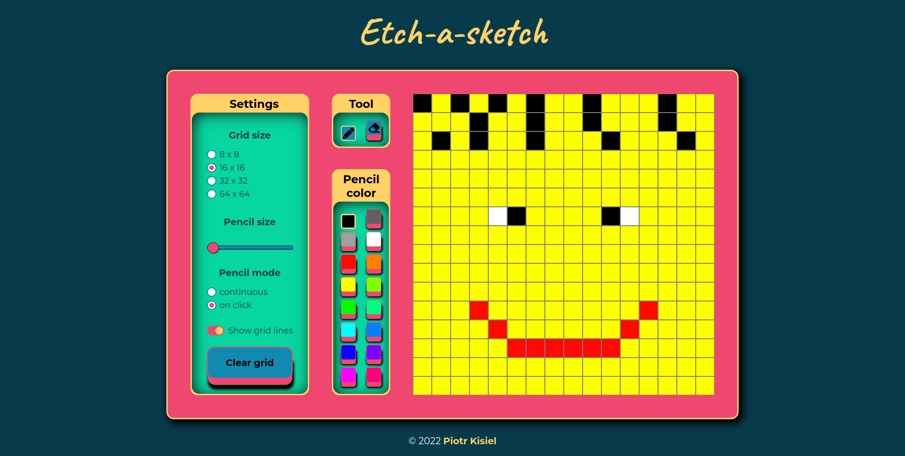

# Etch-A-Sketch

This is a solution to the [Etch-A-Sketch project](https://www.theodinproject.com/lessons/foundations-etch-a-sketch) from [The Odin Project](https://www.theodinproject.com).

# [Live view](https://pietyr.github.io/etch-a-sketch/)

## Table of contents

-   [Overview](#overview)
    -   [The challenge](#the-challenge)
    -   [Screenshot](#screenshot)
        -   [Desktop view](#desktop-view)
-   [My process](#my-process)
    -   [Built with](#built-with)
    -   [What I learned](#what-i-learned)
-   [Author](#author)

## Overview

### The challenge

The challenge is to build a browser version of something between a sketchpad and an Etch-A-Sketch.

Minimal requirements:

-   Create 16x16 grid of square divs
-   Grid divs should change color on hover
-   User can change size of the grid

Non-required features that i added:

-   User can change color
-   User can select eraser tool to erase existing pixels
-   User can change pencil size
-   User can change pencil mode to paint when clicking the mouse only
-   User can hide grid lines

### Screenshot

## My process

### Built with

-   Semantic HTML5 markup
-   CSS custom properties
-   Flexbox
-   Javascript

### What I learned

-   DOM manipulation
-   Styling form elements
-   Javascript classes with private methods and properties

## Author

-   Piotr Kisiel
-   Github - [pietyr](https://github.com/pietyr)
